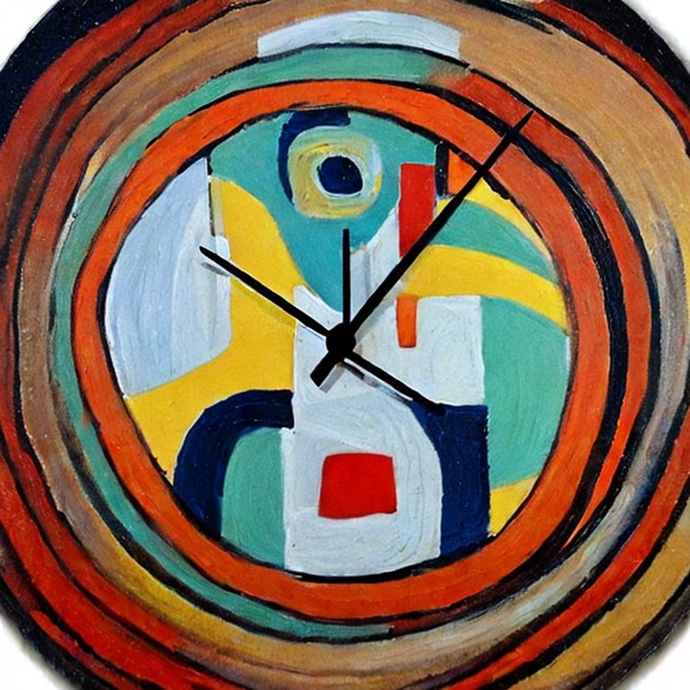
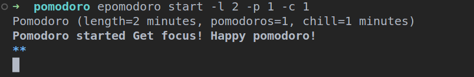

# Easy Pomodoro CLI



## Table of Contents

- [About](#about)
- [Getting Started](#getting_started)
- [Usage](#usage)
- [Test](#test)

## About <a name = "about"></a>

Small CLI application that implements the Pomodoro routine

## Getting Started <a name = "getting_started"></a>

The default pomodoros are 4 with a time range of 20 minutes each one.
After countdown there will be a chill out time to relax.

To install manually cloning the repository

```
pip install --editable .
```

## Usage <a name = "usage"></a>

```
epomodoro start
```

Change default parameters

```
epomodoro start --length 20 --pomodoros 2 --chill 10
```

```
epomodoro start -l 20 -p 2 -c 10
```



## Test <a name= "test"></a>

See Makefile definition

To run test
```
make test
```
